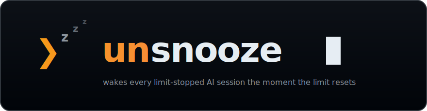
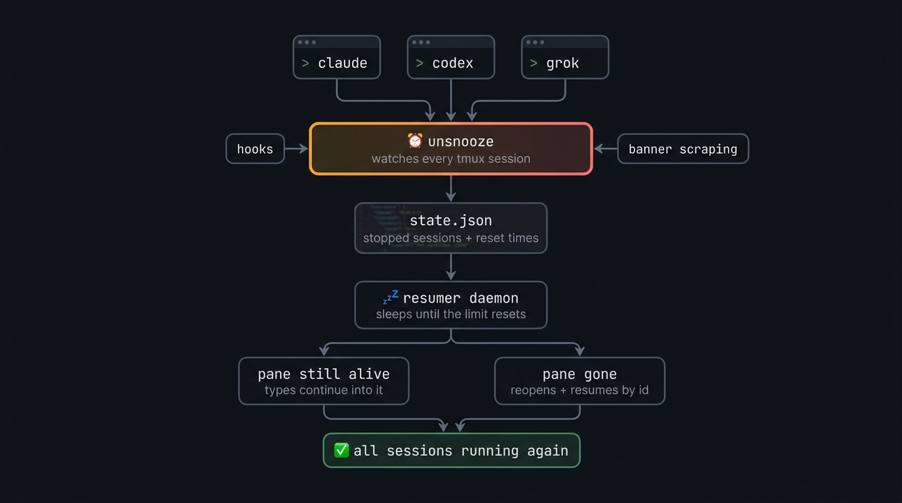

<div align="center">



<br/>

[](https://github.com/saaranshM/unsnooze/actions/workflows/ci.yml)
[](https://www.npmjs.com/package/unsnooze)
[](package.json)
[](LICENSE)

**Claude Code · Codex CLI · Grok · Qwen · Kimi · OpenCode · Antigravity** — when they hit the 5-hour or weekly usage limit
("You've hit your usage limit"), your session just… stops.<br/>
unsnooze auto-resumes them: it tracks **every** limit-stopped session across all
your projects and **wakes each one up in tmux or Zellij the moment the usage limit resets.**

```sh
npm install -g unsnooze && unsnooze setup
```



</div>

## Why unsnooze

Overnight and long-running agent work dies at the 5-hour / weekly limit, and every
existing tool solves only a slice of it:

| | **unsnooze** | claude-auto-retry | autoclaude | hydra |
|---|:---:|:---:|:---:|:---:|
| Multi-CLI (Claude · Codex · Grok · Qwen · Kimi · OpenCode · Antigravity) | ✅ | ❌ Claude only | ❌ Claude only | partial |
| GUI sessions (VS Code ext, desktop apps) | ✅ watcher daemon | ❌ | ❌ | ❌ |
| Waits for reset & resumes the **same** session | ✅ | ✅ | ✅ | ❌ switches provider |
| All sessions at once (shared ledger + one daemon) | ✅ | ❌ one pane | ✅ | ✅ |
| Revives sessions whose pane/process is **gone** | ✅ `--resume <id>` | ❌ | ❌ | ❌ |
| Survives laptop sleep & weekly-scale waits | ✅ epoch polling | partial | partial | n/a |
| Settings + first-run wizard | ✅ | ❌ | ❌ | ❌ |

## Trust & security

unsnooze is a **scheduler that presses your keys — not an auto-approver.** It waits
for your usage limit to reset, then resumes the *same* session. It never changes how
your agent handles permissions.

- **Types only after proving the pane is yours.** Every keystroke requires both
  *identity* (a tmux `@unsnooze_owner` stamp, else a lease = process id + birth
  time — a mismatch vetoes, because pane ids get recycled) and *liveness* (your
  agent is still running there). Pane closes require proven identity (idle
  threshold too for `resumed` panes). Ownership unprovable → it reopens a fresh
  session instead of typing.
- **See before you trust: `unsnooze preview`.** A true dry-run — it prints exactly
  what would be typed, where, and why (or what's holding it back), and sends
  nothing. Preview shares its decision code with the real dispatcher, so it cannot
  drift from what dispatch actually does.
- **Answers Claude's limit menu safely — never a blind Enter.** It locates the
  cursor and the **"Stop and wait for limit to reset"** option and computes the
  exact moves. Unreadable menu → it presses nothing. It will never select
  "Upgrade your plan." Toggle with `menuAutoAnswer`.
- **No `--dangerously-skip-permissions`, no auto-trust, no auto-approve.** unsnooze
  never passes bypass flags, never presses "Yes, I trust this folder," and never
  touches MCP config. Whatever your agent does *after* resuming is governed by
  **its own** permission model — the same as if you'd typed the message yourself.
- **Nearly zero network, zero telemetry.** One version check to
  `registry.npmjs.org` (nothing identifying; `updateCheck=false` turns it off), and
  push notifications only if *you* configure an ntfy topic. State stays local under
  `~/.unsnooze`.
- **Reversible install.** The settings hook and rc-file wrappers are backed up
  first (`*.unsnooze-orig` pristine + `*.unsnooze-bak` rolling); `unsnooze
  uninstall` removes every change. Releases are published with npm provenance.

**Honest limits:** unsnooze *does* inject keystrokes into your live terminal on
your behalf, and it does not sandbox your agent or defend against prompt
injection / malicious repos — that's your agent's job. Full threat model, residual
risks, and vulnerability reporting: **[SECURITY.md](SECURITY.md)**.

## Supported CLIs

- **Claude Code** — dual-channel detection: the `StopFailure` hook (authoritative,
  carries `session_id`) plus multiplexer pane scraping for banners and the interactive
  limit menu (always answered with *"Stop and wait for limit to reset"*, never a
  blind Enter). Dead sessions revive via `claude --resume <id>`.
- **OpenAI Codex CLI** — scrape-based (Codex fires no event on limits). Detects
  the exact `■ You've hit your usage limit …` banner strings from the Codex
  source, parses `try again at 3:51 PM` / `Feb 23rd, 2026 9:01 PM` /
  `in 4 days 20 hours 9 minutes`. Dead sessions revive via
  `codex resume <id> "<message>"` — the prompt travels in argv.
- **Grok Build (xAI)** — ⚠️ *experimental*. Hook channel works (Grok reads
  Claude-compatible hooks, including `StopFailure`); the limit banner text is
  not publicly documented, so detection uses generic patterns with a safe
  fallback. Hit a banner unsnooze missed? Run `unsnooze report` and paste the
  capture into an issue — that's how this adapter gets good.
- **Qwen Code** — ⚠️ *experimental*. Dual-channel: a Claude-shaped `StopFailure`
  hook installed into `~/.qwen/settings.json` (fires with `error: rate_limit`)
  plus scraping for the verbatim quota renders (`Qwen OAuth quota exceeded`,
  Coding Plan `Allocated quota exceeded`, and OpenRouter `Rate limit exceeded:
  limit_…` passthroughs). Qwen never shows a reset time, so waits use the
  5-hour fallback and self-correct on verify. Dead sessions revive via
  `qwen --resume <id>` (session ids come from the `*.runtime.json` sidecars
  qwen writes for exactly this purpose).
- **Kimi CLI (Moonshot)** — ⚠️ *experimental*. Scrape-based: kimi retries a 429
  three times within seconds, then stops with a red `LLM provider error: Error
  code: 429 … rate_limit_reached_error` line — that's the detection anchor.
  The 429 body carries no reset time (5h fallback + verify). Dead sessions
  revive via `kimi -r <id> -p "<message>"` — with a guard: kimi silently starts
  a *new* session for unknown ids, so the id is verified on disk first
  (`--continue` otherwise). `Membership expired` (402) is notify-only.
- **OpenCode** — ⚠️ *experimental*, and a different shape: OpenCode *retries
  rate limits itself, forever*, honoring `retry-after` (it will sleep hours
  until the reset, showing `Rate Limited [retrying in 2h5m attempt #4]`). So
  unsnooze records the stop but never touches a live self-retrying pane; its
  job is reviving sessions whose process died mid-wait (laptop slept, tmux
  gone) via `opencode -s <ses_id>`, with the reset time parsed straight from
  the banner countdown. Zen plan banners (`5 hour/weekly/monthly usage limit
  reached…`) and OpenRouter passthroughs are detected too; `insufficient
  credits` (402) is notify-only.
- **Antigravity CLI (Google, `agy`)** — ⚠️ *experimental*. The Gemini-CLI
  successor. Scrapes the forum-reported quota strings (`Model quota limit
  exceeded`, `Refreshes in 6 days and 18 hours` — parsed, multi-day refresh =
  the weekly cap) and treats `503 MODEL_CAPACITY_EXHAUSTED` as a transient
  overload, not a limit. Dead sessions revive via `agy --conversation=<id>`
  (ids from `~/.gemini/antigravity-cli/history.jsonl`). Like Grok: closed
  source, so `unsnooze report` captures make this adapter better.

**OpenRouter** (the API gateway) isn't a separate agent: its 429 bodies
(`Rate limit exceeded: limit_rpd/…`, free-models-per-day) are detected inside
the CLIs that use it (OpenCode, Qwen Code), and credit exhaustion (402) is
surfaced as a notification — there's no reset to wait for, only a top-up.

## GUI surfaces (VS Code extension, desktop apps)

Terminal sessions are watched through the shell wrapper + tmux or Zellij. Sessions in
**Claude Code's VS Code extension / desktop app** and **Codex's IDE
extension / desktop app** have no pane to scrape — so `unsnooze daemon` tails
the session files those surfaces already write:

- **Claude Code** records every rate-limit stop as a structured entry in its
  `~/.claude/projects/**.jsonl` transcript (session id, cwd, reset time) —
  shared by the CLI and the VS Code extension.
- **Codex** writes a `rate_limits` snapshot (usage %, **exact epoch reset
  time**) into every rollout under `~/.codex/sessions/` — shared by the CLI,
  IDE extension, and the **unified ChatGPT desktop app** (July 2026: the Codex
  app became the ChatGPT app; its bundled `codex app-server` writes the same
  rollouts to the same store — verified against a real install). On machines
  where Codex lives only inside ChatGPT.app (no `codex` on PATH), unsnooze
  automatically resumes through the app-bundled binary
  (`/Applications/ChatGPT.app/Contents/Resources/codex`).
- **Claude desktop (cowork) sessions** *(experimental, macOS)* run in
  sandboxes under `~/Library/Application Support/Claude`; unsnooze watches
  those too and revives with the session's isolated `CLAUDE_CONFIG_DIR`
  (plus the keychain-scope override that keeps auth working — verified
  against a real desktop session).

When the limit resets, the session is revived **in a multiplexer pane** with
`claude --resume <id>` / `codex resume <id>` — it's the same session file, so
the continued conversation stays visible in the GUI's own history. (Resuming
*inside* the GUI panel isn't possible today: no extension/app exposes an
IPC/URI that can send a prompt.)

Enable it in `unsnooze setup` (installs a launchd agent / systemd user unit),
or run `unsnooze install --daemon` / `unsnooze daemon` yourself. Turn it off
anytime with `unsnooze config set guiWatch off`.

## How it works

<div align="center">

</div>

<details>
<summary>text version</summary>

```
claude / codex / grok (shell wrapper) ──► unsnooze _run <agent> ──► CLI in mux pane
                                              │
                                              ├─ per-pane monitor (scrapes for limit
                                              │  banners, drives Claude's limit menu,
                                              │  seconds-scale retry on 5xx/overload)
                                              │
StopFailure hook (claude, grok) ──────────────┤
                                              ▼
                                ~/.unsnooze/state.json
                                { agent, sessionId, cwd, pane, resetAt, status }
                                              │
                                              ▼
                                resumer daemon (singleton, epoch-polling —
                                survives laptop sleep and weekly-scale waits)
                                              │
                          ┌───────────────────┴────────────────────┐
                 pane still alive?                          pane gone?
                 send resume message into it                new multiplexer pane,
                 (only if the CLI is foreground             `unsnooze _run <agent>
                 and not mid-stream)                        --resume <id>`, verify
```

</details>

Limit events are never persisted by the CLIs themselves; the reset time is
parsed from the banner text, DST-safe, with a 5-hour fallback when unparseable
— and every resume is verified afterwards (banner came back → reschedule from
the fresh banner, capped at 5 attempts).

## Usage

```sh
claude / codex / grok           # normal usage — wrapped automatically
unsnooze status                 # tracked sessions + reset countdowns
unsnooze resume-now [id|--all]  # don't wait for the reset time
unsnooze cancel [id|--all]      # stop tracking a session
unsnooze message <id> "text"    # per-session wake message (--clear to reset)
unsnooze preview [id]           # dry-run: what WOULD happen right now, and why —
                                # nothing is typed or opened
unsnooze sessions               # list unsnooze-owned mux sessions + panes
unsnooze reap [--dry-run|--yes] # close finished panes / empty sessions (default dry-run)
unsnooze doctor [--fix]         # install health check + retire old csg leftovers
unsnooze config list            # settings (see below)
unsnooze config set <k> <v>     # e.g. autoResume off
unsnooze logs [-f]              # what unsnooze has been doing
unsnooze update                 # update unsnooze itself
unsnooze daemon                 # persistent GUI-session watcher (usually run
                                # by launchd/systemd via `install --daemon`)
unsnooze report [agent]         # capture a pane to report an undetected banner
unsnooze uninstall [--purge]    # remove wrappers + hooks (+ state with --purge)
unsnooze help                   # full command list (also -h / --help)
```

## Settings

`unsnooze setup` writes `~/.unsnooze/config.json`; change anything later with
`unsnooze config set`:

| key | default | meaning |
|---|---|---|
| `multiplexer` | `auto` | Backend to use: `auto`, `tmux`, or `zellij`. `auto` prefers the current multiplexer, then the only installed backend, with tmux as the tie-breaker. |
| `autoResume` | `true` | Master switch. Off = stops are still tracked, but nothing is resumed until you run `unsnooze resume-now` or turn it back on. |
| `menuAutoAnswer` | `true` | May unsnooze answer Claude's limit menu (send keys in your pane)? Off = watch-only. |
| `notifications` | `true` | Master switch for all notifications (limit detected / session resumed / gave up). Off = silence every channel. |
| `notifyChannel` | `auto` | How to deliver: `auto`, `native`, `osc`, or `bell` (see [Notification channels](#notification-channels)). Env: `UNSNOOZE_NOTIFY_CHANNEL`. |
| `guiWatch` | `true` | May the daemon watch session files for GUI-surface stops (VS Code extension, desktop apps)? Needs the daemon running (`unsnooze install --daemon`). |
| `resumeMessage` | *"Continue where you left off…"* | The message sent to wake a session. Override it for a single session with `unsnooze message <id> "…"` — visible in `unsnooze status`. |
| `resumeMessages.claude` / `.codex` / `.grok` / `.qwen` / `.kimi` / `.opencode` / `.agy` | `""` | Per-agent override of `resumeMessage`. Empty = use the global message; clear one with `unsnooze config set resumeMessages.claude ""`. |
| `agents.claude` / `agents.codex` | `true` | Which CLIs are guarded. |
| `agents.grok` / `agents.qwen` / `agents.kimi` / `agents.opencode` / `agents.agy` | `false` | Experimental adapters — off by default; enable in `unsnooze setup` or `unsnooze config set agents.qwen on`. |
| `workspaceGuard` | `inform` | Repo changed while a session slept? `inform` wakes it with a heads-up in the message; `pause` holds it (desktop notification, diff shown on `resume-now`); `off` disables. |
| `contextGuard` | `inform` | Big cold context at wake? Waking a session re-reads its **entire context at full uncached price** ([why](#why-did-resuming-a-big-session-eat-so-much-of-my-quota)). `inform` resumes and notifies you of the size; `pause` holds sessions above the threshold for `unsnooze resume-now`; `off` disables. Claude Code only for now. |
| `contextGuardTokens` | `100000` | Context-size threshold (tokens) at which `contextGuard` notifies or holds. |
| `reapResumed` | `false` | Opt-in: auto-close `resumed` panes idle longer than `reapIdleAfter`. Off by default — use `unsnooze reap --yes` for explicit cleanup. |
| `reapIdleAfter` | `604800000` (7d) | Idle age (ms) before an opt-in auto-reap closes a `resumed` pane. |
| `updateCheck` | `true` | Daily new-version check (a plain GET to the npm registry, nothing identifying is sent). Notices after commands + one desktop toast per version. |
| `ntfyTopic` | `""` | [ntfy](https://ntfy.sh) push notifications — **off until set**. Fires *alongside* the local channel on limit-hit / resumed / gave-up. ⚠️ ntfy.sh topics are public — the name is the password. Use an unguessable one, e.g. `unsnooze-$(openssl rand -hex 8)`, a token, or a self-hosted server. |
| `ntfyServer` | `https://ntfy.sh` | ntfy server base URL (self-hosted servers welcome). |
| `ntfyToken` | `""` | Optional `tk_…` access token (`Authorization: Bearer`) for reserved topics / authed servers. |
| `ntfyPrivacy` | `full` | `terse` keeps directory paths out of pushed bodies (titles only) — recommended on public ntfy.sh topics. |

Every setting also has a `UNSNOOZE_*` env override (see `src/settings.js`), and
all timings/paths are tunable via `UNSNOOZE_*` env vars (see `src/config.js`).

### Multiplexer session names

Interactive launches own the base session name (default **`unsnooze`**); a second
concurrent terminal takes `unsnooze-2`, etc. The resumer daemon may **join** a
live session but only ever **creates** `unsnooze-resumed`, so a revived agent
never steals the interactive name.

| env | default | meaning |
|---|---|---|
| `UNSNOOZE_SESSION_NAME` | `unsnooze` | Interactive base session name (also accepts legacy `UNSNOOZE_TMUX_SESSION`). |
| `UNSNOOZE_RESUME_SESSION` | `<base>-resumed` | Session the daemon creates when the pane's original session is gone. |

Find revived agents with `unsnooze status` (prints an attach hint when the
session is live), `unsnooze sessions`, or e.g. `tmux attach -t unsnooze-resumed`.

### Notification channels

When a limit is hit, a session resumes, or unsnooze gives up, it can alert you
via an OS toast, a terminal OSC sequence, a BEL, or a mix — controlled by
`notifyChannel` (default `auto`). `notifications=false` (or
`UNSNOOZE_NOTIFICATIONS=off`) turns every channel off.

| channel | what it does |
|---|---|
| `auto` | OSC (when the terminal supports it) **plus** BEL on the pane tty; falls back to native only if OSC delivered nothing (avoids double banners). No pane / non-tmux mux → native. |
| `native` | OS toast (macOS `osascript`, Linux `notify-send`, WSL/Windows PowerShell toast); tmux `display-message` as a last-resort statusline fallback on other platforms. |
| `osc` | Force OSC to attached client ttys; native if zero deliveries. |
| `bell` | BEL to the pane tty; native if undeliverable. |

**Terminal support (OSC)** — detection uses `TERM_PROGRAM` / termname / known
env markers:

| terminals | sequence |
|---|---|
| iTerm2, kitty, WezTerm, Ghostty, Warp | OSC 9 (`\x1b]9;title: body\x07`) |
| rxvt / urxvt | OSC 777 (`\x1b]777;notify;title;body\x07`) |
| Apple Terminal, VS Code, Alacritty, Zed | denylisted — OSC skipped (prefer `native`; force `osc` does not unlock these) |
| unknown | skipped in `auto`; OSC 9 when `notifyChannel=osc` |

**tmux only for OSC/BEL.** Those paths write to the client's tty (OSC) or the
pane's tty (BEL), which requires tmux's client/pane tty APIs. **Zellij has no
equivalent**, so OSC/BEL are not attempted under Zellij — notifications fall
back to native (and Zellij has no statusline-inject equivalent either). GUI
watcher stops (no pane context) always use native.

## Safety properties

- **Never injects blind**: keys are only sent when the pane's foreground
  process is the agent CLI and no "esc to interrupt"-style busy footer is
  visible. Recycled pane ids can't receive stray messages.
- **Never picks a menu option blind**: if Claude's limit menu layout can't be
  read, unsnooze does not press Enter (that could confirm "Upgrade your plan").
- **Sleep-safe waits**: the resumer polls wall-clock against the target epoch
  every 30s instead of one long timer — a laptop asleep past the reset fires
  on the next tick. Weekly limits are just a bigger epoch.
- **Verified resumes**: after dispatch it re-captures the pane; if the limit
  banner reappears (reset time misparsed / not actually reset), it reschedules
  from the fresh banner, capped at 5 attempts.
- **Concurrent-writer safe**: state updates go through a mkdir lock + atomic
  rename; corrupt state is quarantined, never fatal (the hook path must never
  block the CLI).
- **Overload ≠ limit**: 5xx/529/429 transient errors take a seconds-scale
  backoff path ([30,60,120,240,300]s ± jitter) and never enter the ledger.
- **Stale-workspace guard**: the repo's HEAD + dirty state are fingerprinted
  when a session stops. If another session (or you) changed the repo before
  the wake, the resumed agent is told to re-read before acting — or, with
  `workspaceGuard=pause`, the session is held and `unsnooze resume-now`
  shows the diff first.
- **Cold-cache wake guard**: waking a session after hours means the provider's
  prompt cache is long expired — the first message re-reads the entire
  context at full price, and a fat session can eat a real slice of the fresh
  quota window. unsnooze estimates the size from the session transcript
  (shown as `ctx ~152k tok` in `unsnooze status`) and, per `contextGuard`,
  notifies you or holds the session instead of spending it silently.

## Requirements

- Node ≥ 20 and tmux ≥ 3.2 **or** Zellij
- macOS, Linux, or **Windows via WSL** (see below)
- zsh or bash (the wrappers are installed into `~/.zshrc` / `~/.bashrc`)

### Windows / WSL

tmux and Zellij are Unix tools, so on Windows unsnooze runs inside
[WSL](https://learn.microsoft.com/windows/wsl/install) — which is where the
agent CLIs live on Windows anyway:

```sh
# inside your WSL distro (Ubuntu etc.)
sudo apt install tmux             # or install Zellij: https://zellij.dev/documentation/installation
npm install -g unsnooze && unsnooze setup
```

On macOS, install either backend with `brew install tmux` or
`brew install zellij`. In `auto` mode unsnooze uses the multiplexer you are
currently inside; choose one explicitly with
`unsnooze config set multiplexer tmux` or `zellij`.

Everything works as on Linux, including desktop notifications: inside WSL,
unsnooze raises **native Windows toasts** through `powershell.exe` (no
`notify-send` or X server needed). Native Windows (PowerShell/cmd, no WSL) is
not supported — without tmux or Zellij there is no terminal pane to watch; unsnooze will tell you
so and run your CLI unwatched instead of breaking it.

## FAQ

### What does "You've hit your usage limit" mean in Claude Code?

Claude subscription plans meter usage in a rolling 5-hour window plus a weekly
cap. When either runs out, Claude Code stops mid-task and shows the banner with
a reset time ("resets 3pm"). Nothing is lost — the session can be resumed with
`claude --resume <id>` once the limit resets. unsnooze does exactly that,
automatically, for every stopped session.

### What about Codex — "You've hit your usage limit. Try again at …"?

Same idea: ChatGPT-plan Codex has 5-hour and weekly windows. The Codex TUI
stays open at the composer after the banner, so unsnooze either types into the
live pane or reopens the session with `codex resume <id>` at the reset time it
parsed from the banner.

### Does this get around the rate limit?

No. unsnooze waits for the reset exactly like you would, resumes once, and
verifies the limit actually lifted. It replaces the 4am alarm, not the limit.

### How do I update, and how do I know when to?

`unsnooze update` (or `npm i -g unsnooze`). unsnooze checks the npm registry at most once a day and
tells you when a newer version exists (a line after CLI commands, plus one
desktop notification per version); after updating, the next command shows a
short "what's new" from the changelog. It's a plain registry GET with nothing
identifying — turn it off with `unsnooze config set updateCheck off`.

### What if another session changed the repo while one was stopped?

unsnooze fingerprints the workspace (HEAD + uncommitted state) at stop time
and re-checks at wake. By default the session still resumes, but the wake
message includes what changed ("HEAD abc1234 → def5678 — re-read before
continuing"). Set `workspaceGuard` to `pause` to hold such sessions for a
manual `unsnooze resume-now` (which prints the diff stat), or `off` to
disable the check.

### Why did resuming a big session eat so much of my quota?

Because of prompt-cache expiry, not because of unsnooze. Providers cache your
session's context so each turn only pays full price for what's new — but that
cache lives ~5 minutes. After hours stopped at a limit, the cache is long
gone, so the **first** wake message (unsnooze's, or a hand-typed "continue" —
identical cost either way; the wake message itself is ~30 tokens) makes the
API re-read the entire conversation at full uncached price. A ~150k-token
session on a top-tier model can cost a meaningful slice of a fresh 5-hour
window the moment it wakes, before any new work happens.

What actually helps: `/compact` (or starting a fresh session with a handoff
summary) *before* you hit the limit, and keeping overnight sessions lean.
What unsnooze does: the `contextGuard` setting estimates the context size
from the session transcript before waking. `inform` (default) resumes and
notifies you of the price; `pause` holds sessions above `contextGuardTokens`
(default 100k) until you decide with `unsnooze resume-now`; the estimate is
also visible per-session in `unsnooze status` (`ctx ~152k tok`).

### Does it work if my laptop was asleep or the terminal was closed?

Yes — reset times are stored as absolute timestamps and checked every 30
seconds, so a laptop that slept through the reset resumes on the next tick,
and dead panes are reopened by session id in a fresh multiplexer pane.

## Development

```sh
npm test                     # unit tests (node:test)
./scripts/e2e-simulate.sh    # full detect → wait → re-open cycle in a
                             # scratch tmux session (no real limits needed)
bash -n scripts/e2e-zellij.sh # syntax-check the reserved-session Zellij smoke test
vhs demo/demo.tape           # regenerate assets/demo.gif (brew install vhs)
```

Releases are tagged (`git tag v<version> && git push origin v<version>`) and
published to npm by CI with [provenance](https://docs.npmjs.com/generating-provenance-statements)
via trusted publishing — see `.github/workflows/release.yml`.

## License

[MIT](LICENSE)
