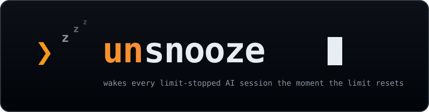
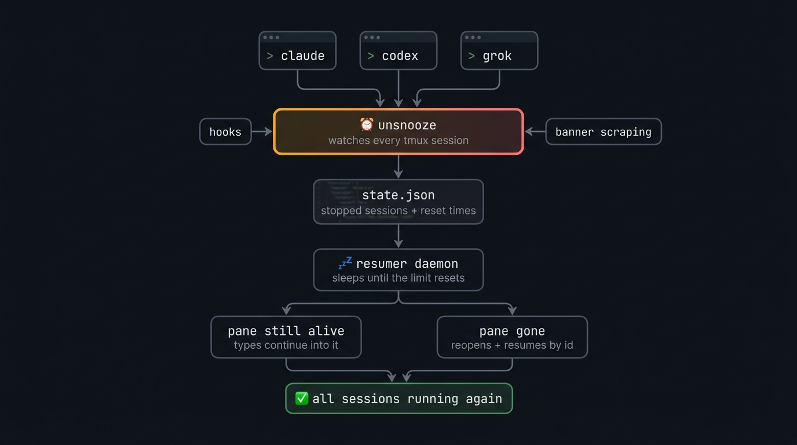

<div align="center">



<br/>

[](https://github.com/saaranshM/unsnooze/actions/workflows/ci.yml)
[](https://www.npmjs.com/package/unsnooze)
[](package.json)
[](LICENSE)

**Automatically resume every limit-stopped AI coding session when its usage limit resets.**

[Website](https://unsnooze.dev) · [Documentation](https://unsnooze.dev/docs/) · [Changelog](https://unsnooze.dev/changelog/) · [Feedback](https://unsnooze.dev/feedback/)

**Claude Code · Codex CLI · Grok · Qwen · Kimi · OpenCode · Antigravity · Cursor** — when they hit the 5-hour or weekly usage limit
("You've hit your usage limit"), your session just… stops.<br/>
unsnooze auto-resumes them: it tracks **every** limit-stopped session across all
your projects and **wakes each one up the moment the usage limit resets** — in
tmux, Zellij, herdr or cmux, and on **macOS, Linux and Windows**, with or
without a terminal multiplexer.

```sh
npm install -g unsnooze && unsnooze setup
```



</div>

## Why unsnooze

Overnight and long-running agent work dies at the 5-hour / weekly limit, and every
existing tool solves only a slice of it:

| | **unsnooze** | claude-auto-retry | autoclaude | hydra |
|---|:---:|:---:|:---:|:---:|
| Multi-CLI (Claude · Codex · Grok · Qwen · Kimi · OpenCode · Antigravity · Cursor) | ✅ | ❌ Claude only | ❌ Claude only | partial |
| GUI sessions (VS Code ext, desktop apps) | ✅ watcher daemon | ❌ | ❌ | ❌ |
| Waits for reset & resumes the **same** session | ✅ | ✅ | ✅ | ❌ switches provider |
| All sessions at once (shared ledger + one daemon) | ✅ | ❌ one pane | ✅ | ✅ |
| Revives sessions whose pane/process is **gone** | ✅ `--resume <id>` | ❌ | ❌ | ❌ |
| Survives laptop sleep & weekly-scale waits | ✅ epoch polling | partial | partial | n/a |
| Settings + first-run wizard | ✅ | ❌ | ❌ | ❌ |

## Quick start

```sh
npm install -g unsnooze
unsnooze setup      # pick agents; installs shell wrappers + the Claude hook
```

Then use `claude`, `codex` and the rest exactly as before — the wrappers run them
in a watched pane. When one hits its limit, unsnooze records the stop and wakes it
the moment the limit resets.

```sh
unsnooze status               # tracked sessions + reset countdowns (live dashboard on a TTY)
unsnooze preview [id]         # dry-run: what would be typed, where, and why — sends nothing
unsnooze resume-now [id|--all]
unsnooze usage                # burn rate and time-to-limit, before you hit the wall
unsnooze doctor [--fix]       # install health check
```

Needs Node ≥ 20.12 on macOS, Linux or Windows. tmux ≥ 3.2, Zellij, herdr ≥ 0.8
or cmux give pane-level watching; without one, unsnooze runs headless and still
catches and resumes stops. Every command: [command reference](https://unsnooze.dev/docs/commands/).

## Supported agents

| Agent | Detection | Revival |
|---|---|---|
| **Claude Code** | `StopFailure` hook + pane + transcripts; answers the limit menu safely | `claude --resume <id>` |
| **Codex CLI** / ChatGPT app | pane banner + rollout files (exact reset time) | `codex resume <id>` |
| Grok Build *(experimental)* | hook + pane | `grok --resume <id>` |
| Qwen Code *(experimental)* | hook + pane | `qwen --resume <id>` |
| Kimi CLI *(experimental)* | pane | `kimi -r <id>` |
| OpenCode *(experimental)* | pane (it retries by itself; unsnooze revives it if it dies) | `opencode -s <id>` |
| Antigravity `agy` *(experimental)* | pane | `agy --conversation=<id>` |
| Cursor `cursor-agent` *(experimental)* | pane; billing-cycle limit, so it probes instead of scheduling | `cursor-agent --resume=<id>` |

GUI sessions (Claude Code's VS Code extension, the ChatGPT/Codex desktop app,
Claude desktop) are watched through the files they already write, by the optional
daemon. Per-agent details, OpenRouter, proxy launchers like Headroom, and Claude
Design: [supported agents](https://unsnooze.dev/docs/agents/).

**Codex behind [CLIProxyAPI](https://github.com/router-for-me/CLIProxyAPI)** (multi-account
pool): set `cliproxyUrl` and `cliproxyKey`, and a stopped Codex session wakes as soon as
*any* account in the proxy has quota again. Check it with `unsnooze cliproxy`. Details:
[Codex behind CLIProxyAPI](https://unsnooze.dev/docs/agents/#cliproxy).

## How it works

<div align="center">

</div>

Stops are detected from agent hooks, saved session files and terminal banners,
and recorded in `~/.unsnooze/state.json` with the reset time. A single daemon
checks the clock every 30 seconds — so a laptop that slept through the reset still
wakes on time — then types your resume message into the live pane, or reopens the
session by id if its pane is gone. Every wake is verified; if the limit is still
there it reschedules, up to 5 attempts.

## Trust & security

unsnooze is a **scheduler that presses your keys — not an auto-approver.**

- **Types only after proving the pane is yours** — an ownership stamp or process
  lease, plus your agent running and idle there. Unprovable → it opens a fresh
  session instead of typing.
- **Never presses a menu option blind**, and never selects "Upgrade your plan".
- **No `--dangerously-skip-permissions`, no auto-trust, no auto-approve.** What
  your agent does after the wake is governed by its own permission model.
- **No telemetry.** One daily version check to npm (`updateCheck=false` turns it
  off) and ntfy push only if you set it up. State stays in `~/.unsnooze`.
- **Reversible.** Every file it edits is backed up; `unsnooze uninstall` removes
  every change. Releases are published with npm provenance.
- **Fleet (multi-machine) uses your own SSH** — no ports, no tokens, no weakened
  host-key checking.

It does inject keystrokes into your terminal, and it does not sandbox your agent.
Full threat model and vulnerability reporting: **[SECURITY.md](SECURITY.md)**.

## FAQ

**What does "You've hit your usage limit" mean?** Claude and ChatGPT plans meter
usage in a rolling 5-hour window plus a weekly cap. When either runs out, the
agent stops mid-task. Nothing is lost — the session can be resumed after the
reset, and unsnooze does that for every stopped session automatically.

**Does this get around the rate limit?** No. It waits for the reset exactly like
you would, resumes once, and checks the limit actually lifted. It replaces the
4am alarm, not the limit.

More questions and troubleshooting: [unsnooze.dev/docs/troubleshooting](https://unsnooze.dev/docs/troubleshooting/).

## Documentation

- [Install & setup](https://unsnooze.dev/docs/) — terminals, multiplexers, Windows and WSL
- [Supported agents](https://unsnooze.dev/docs/agents/)
- [Commands](https://unsnooze.dev/docs/commands/) — usage forecast, queued prompts
- [Settings & guards](https://unsnooze.dev/docs/settings/) — every config key, notifications
- [Fleet](https://unsnooze.dev/docs/fleet/) — sessions on every machine over SSH, GUI surfaces
- [Troubleshooting & security](https://unsnooze.dev/docs/troubleshooting/) — including development setup
- [Changelog](CHANGELOG.md)

## License

[MIT](LICENSE)
